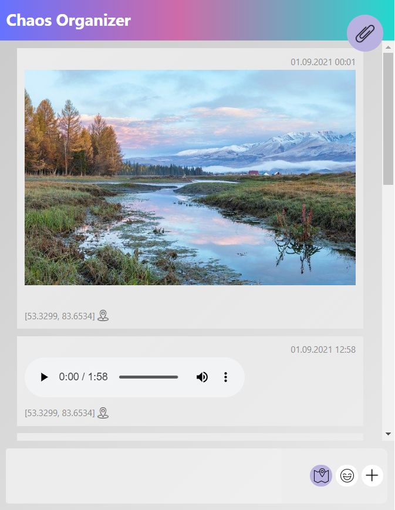
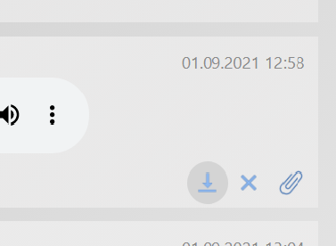
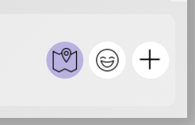
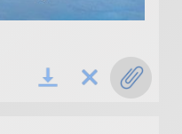
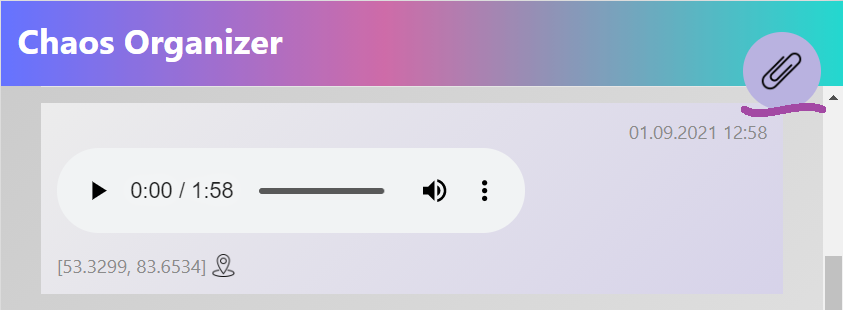

+ [github-page](https://Anna-Kolycheva/ahj-diploma-ChaosBot.github.io/)
+ [backend](https://github.com/Anna-Kolycheva/ahj-diploma-ChaosBot-backend)

# Дипломное задание к курсу «Продвинутый JavaScript в браузере». Chaos Organizer 
  

### Обязательный функционал
* Сохранение в истории ссылок и текстовых сообщений

* Ссылки (то, что начинается с http:// или https://) кликабельны и отображаются как ссылки

* Сохранение в истории изображений, видео и аудио (как файлов) - через Drag & Drop и через иконку загрузки ("+" в нижнем меню)

* Скачивание файлов (на компьютер пользователя)
	- oсуществляется кликом на иконке загрузки, появляющемся под сообщением при наведении курсора мыши.
		 

* Ленивая подгрузка: сначала подгружаются последние 10 сообщений, при прокрутке подгружаются следующие 10 и т.д.
	
## Дополнительный функционал 
* Синхронизация - если приложение открыто в нескольких окнах (вкладках), то контент должен быть синхронизирован
	- сообщения обновляются без перезагрузки страницы, во всех открытых окнах. 

* Отправка геолокации
	- геолокация прикрепляется к каждому сообщению, если она включена в нижнем меню (иконка геолокации - цветная), если значек серого цвета - геолокация прикреплена не будет. Переключение осуществляется кликом по иконке. Если в браузере запрещена отправка геолокации, откроется модальное окно с предупреждением.
		 

* Воспроизведение видео/аудио (используя API браузера)

* Закрепление (pin) сообщений, закреплять можно только одно сообщение (появляется скрепка в верхней части страницы):
	- закрепление файлов, oсуществляется кликом на иконке со скрепкой, появляющейся под сообщением при наведении курсора мыши, закрепление сообщение преобретает сереневый цвет.
		 
	- при нажатии на значек закрепленного сообщения, если сообщение загружено в ленте, лента прокручивается до закрепленного сообщения.
   - если сообщение не загружено - подгружается с сервера и отображается вверху ленты на некоторое время.
		 
 * Поддержка смайликов (emoji)
   - на нижнем меню значек с улыбкой :).